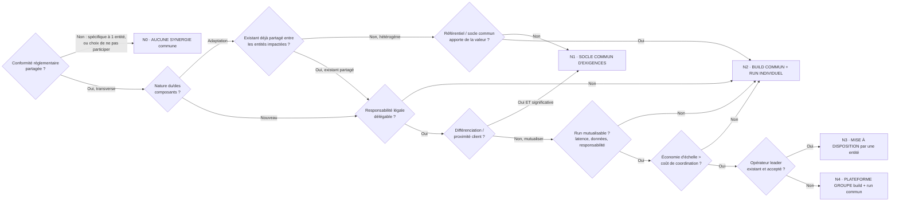
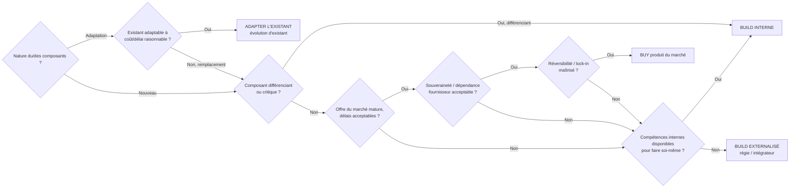

# Blueprint des arbres de décision du GT

> Structure de branchement complète des deux arbres (source de vérité Mermaid).
> [SRC: support GT TEC/DTDI (CA), captures fournies par Alex le 2026-07-09]
> Le peuplement (passage des briques dans les arbres) se fait dans reglementations/<reg>/arbres.md.

## Garde-fous (rappel des slides)

- Cet arbre est une aide à la décision, pas une règle à appliquer « by the book ». Il structure
  le raisonnement et garantit de se poser les mêmes questions pour chaque composant ; chaque
  sortie reste une orientation à confirmer en atelier, pas un verdict automatique.
- Le GT oriente d'un point de vue architecture. La réussite d'une mutualisation dépend aussi de
  facteurs exogènes hors du contrôle du GT (gouvernance, capacité des entités, juridique,
  calendrier, budget).
- Le gain de mutualisation ne couvre qu'une partie de l'effort : à tout niveau de mutualisation,
  l'adaptation du SI existant demeure, peut égaler le coût des briques communes, et doit être
  chiffrée pour elle-même.

## Arbre 1 — Mutualisation (quel niveau de partage ?)

Maille d'application : sous-ensemble de fonctionnalités ou fonctionnalité structurante.
Aller au-delà du socle commun d'exigences implique de spécifier le besoin, les défis (TTM),
les gains (chiffrables / estimés).

### Les niveaux : définitions et enjeux

| Niveau | Définition | Enjeux |
|--------|-----------|--------|
| N0 · Aucune synergie commune | L'entité conçoit, construit et opère seule, sans exigences communes. Réservé à un composant spécifique à une seule entité, ou un contexte réglementaire particulier. | Rapidité et maîtrise locale, contre l'absence d'économie d'échelle et de cohérence Groupe. |
| N1 · Socle commun d'exigences | Un référentiel d'exigences communes obligatoires (réglementaires, non fonctionnelles, normatives) que chacun respecte, en implémentant librement, sans build partagé. | Garantir conformité et interopérabilité minimales sans imposer de convergence technique ; préserver l'existant et l'autonomie d'implémentation. |
| N2 · Build commun + run individuel | Le composant (ou un socle technique) est conçu et développé une fois en commun, puis déployé et opéré par chaque entité dans son SI. | Mutualiser le coût et la cohérence de la construction tout en gardant la main locale sur le run et les données. |
| N3 · Mise à disposition par une entité | Une entité leader construit et opère le composant, puis l'expose en service aux autres (modèle fournisseur intragroupe). | Capitaliser sur l'entité la plus avancée, un seul build+run à financer, déploiement rapide pour les consommateurs. |
| N4 · Plateforme Groupe (build + run commun) | Un composant unique, construit et exploité de bout en bout par une structure Groupe dédiée, pour toutes les entités (mutualisation maximale). | Économies d'échelle maximales, cohérence totale, point unique d'évolution et de négociation (BCE, fournisseurs). |
| N5 · Interbancaire | *(niveau évoqué dans la méthode, absent des slides sources — à confirmer ⚠️)* | — |

## Arbre 2 — Make vs Buy (quelle stratégie de réalisation ?)

Note de portée sur ADAPTER L'EXISTANT : la portée dépend de la maille de l'arbre de
mutualisation, adaptation une fois si existant partagé / mutualisé, sinon par entité.

## Articulation des deux arbres

L'orientation de mutualisation (quel niveau de partage ?) se prend d'abord ; l'orientation de
réalisation (build, buy ou adapter ?) se prend ensuite, à la maille issue de l'arbre 1.
Chaque passage d'une brique dans les arbres se trace dans reglementations/<reg>/arbres.md
(chemin, sortie, justification, hypothèses conditionnantes, séance source).
