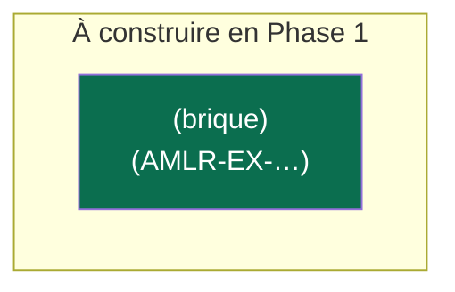

# Cartographie applicative — AMLR / Paquet anti-blanchiment

> Maillon 4 de la chaîne. Source de vérité en Mermaid ; conversion .drawio à la demande
> (skill NDA drawio-diagram). Maille « application / service » regroupée en macro-briques.
> Chaque brique liste les exigences qu'elle porte (AMLR-EX-NNN).

## Conventions (héritées €N / CRA)
- Code couleur : **New** / **Adaptation** / **Périmètre externe** / **Entity specific** / **Other**
- Échelle d'impacts : Très élevé / Élevé / Moyen / Faible / Très faible / N/A
- Chaque vue dérivée part de cette carto de base.

## Carto de base (à construire en Phase 1)

## Vues dérivées
- Vue impacts · Vue responsabilités par rôle · Vue par entité · Vue existant vs nouveau
