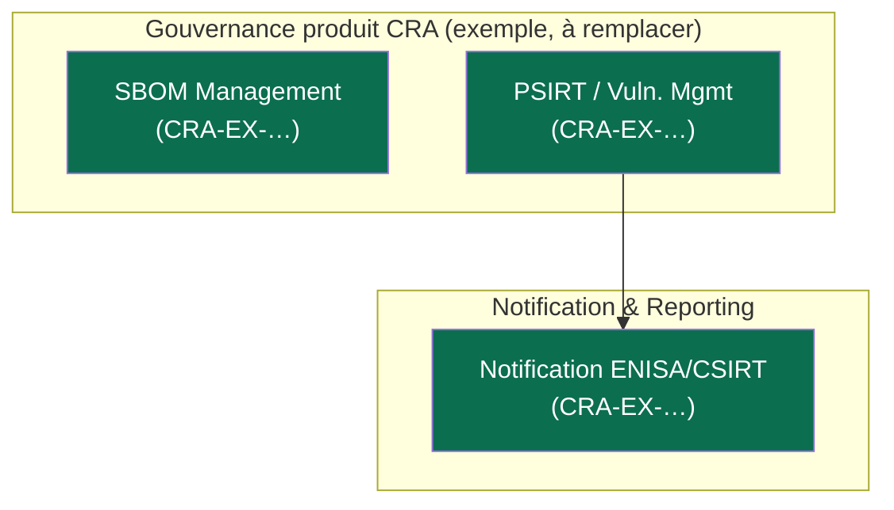

# Cartographie applicative — CRA

> Maillon 4 de la chaîne. Source de vérité en Mermaid ; conversion .drawio à la demande
> (skill NDA drawio-diagram) pour les livrables. Maille « application / service »
> regroupée en macro-briques. Chaque brique liste les exigences qu'elle porte (CRA-EX-NNN).

## Conventions (héritées €N)
- Code couleur : **New** (vert foncé) / **Adaptation** (vert clair) / **Périmètre externe**
  (violet, ex. plateformes ENISA) / **Entity specific** (bordure) / **Other** (rose)
- Échelle d'impacts pour la map d'impacts : Très élevé / Élevé / Moyen / Faible / Très faible / N/A
- Chaque vue dérivée (impacts, responsabilités par rôle, par entité) part de cette carto de base.

## Carto de base (à construire en Phase 1)

## Vues dérivées (une section par vue, même base)
- Vue impacts (à date) · Vue responsabilités par rôle du texte · Vue par entité · Vue existant vs nouveau
